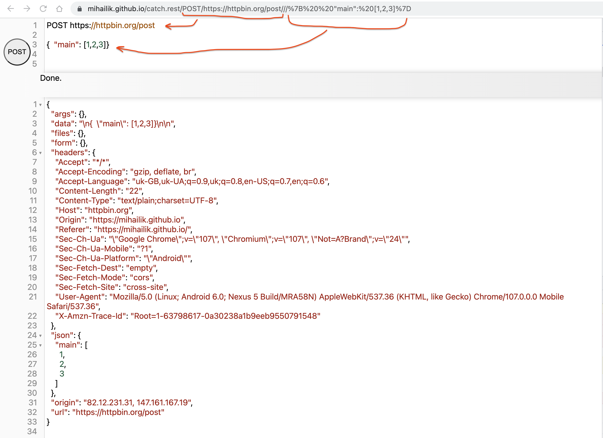

# This is a prototype project code name Catch REST &#x1F379;

## What is Catch REST &#x1F379; now

A tool in some ways similar to Postman or Fiddler, letting you to prepare and fire HTTP requests and investigate results.

You will type your request in text area at the top, press a button and see resuls appear at the bottom. In many ways
Catch REST &#x1F379; is much simpler, and much more powerful than existing REST tools.

### Simple text

Your request is plain text. Whole of it!

No more tabs and fields and radio buttons. Everything is raw glorious searchable copy-pasteable text.

URL is in text, method is in text, headers in text, body. **EVERYTHING** is in text. Finally!

You get intuitive syntax highlight and auto-detection of common conventions. Catch REST &#x1F379; doesn't do passive aggressive,
it's in your corner.

### Addressable text

Your request is reflected in the address bar. Whole of it!

That means you can take the URL and paste it in the chat to support. You can stick it in the Wiki as a verification.
You can store it in the comments.

### Formats auto-detection

Did I say Catch REST &#x1F379; doesn't do passive aggressive?

If your HTTP request returns JSON, you're going to see nicely formatted, navigable JSON.

If it's XML, you'll have equally usable XML tree.

For cases where result is obviously tabular data, you'll have a grid view enabled (in addition to the raw view).
That also covers CSV or Excel outputs. It doesn't take rocket science to detect and add extra views for PNG
and other image formats, or auto-handle weird nested JSON-in-string-inside-XML envelopes plaguing many
corporate messaging pipelines.

## Long term view

The goal is to allow on-the-fly active editor similar in effect to REPL or Notebooks.

The first milestone is an HTTP request tool, which is in progress now.

In parallel I am adding quick and simple Unicode character formatting,
helpful for posting on social media platforms. My current prototype for that
is on https://tty.wtf and as I build up Catch REST &#x1F379; the two may even merge.

The next step is to support Markdown, with inclusion of scripted fields.

The plan also is to allow JavaScript and some kind of simplified Excel syntax inside scripted fields.
That, plus HTTP requester would allow for more complex processing of Internet data,
issuing requests, processing data and representing the data in sensible way with tables/charts.

## Architecture and code structure

Extremely original, but out of laser focus on pragmatic goal.

### Goal

Catch REST &#x1F379; must be virtually unbreakable from any of its intended use standpoints.

It must work in any reasonable browser. It must survive in strange conditions of embedded webview,
fired from command line, and few even more exotic scenarios.

I don't want it to be defeated by choppy network conditions, or bizarre build dependencies.

### Solution

I take ultra-pragmatic approach assuming Catch REST &#x1F379; only gets **1 chance to impress you,**
and it cannot fail. And I take all the ruthlessness and inventiveness of a computer virus mentality
to deliver even impossible.

The whole of the code lives inside a single JS file (170K at the moment). This is the source code, and run code.

I use JSDoc to benefit from type checking, without transpilation phase.

The whole of dependent libraries lives inside another JS file (12Mb).

The code is ES3. Yes, good old IE6-compatible ES3, not even ES5. Once in a while I whip up my trusty VM to fix
an odd `let` or trail comma creeping into the code. The looks may degrade (no gradients and subtle shadows)
but it will work in every sane browser.

There is no UI framework, it's DOM manipulation and some 3rd party component calls (such as CodeMirror).

The code that bundles the libraries and runs mini-development HTTP server is inside that same JS file too.
Yes, that means same code is run in browser and node, and auto-detects environment to do the expected thing.

## For good luck!

In my career I've built similar tools, that helped me write software, debug software,
reproduce bugs and explore systems.

Writing code successfully in a corporate environment demands patience and strong will.
Some of the tricks I've accumulated in my career, I am putting to use in this hobby project.

I hope it works — firstly for me, and hopefully helps others.

*Ka chi fo!*

<!-- {build-by-hash:l5yr328xm7 Thu Nov 24 2022 23:47:17 GMT+0000 (Greenwich Mean Time) darwin/x64} -->
